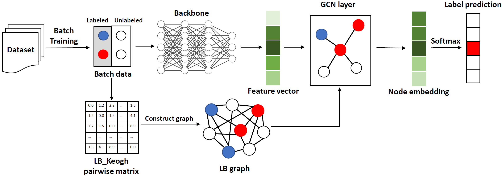

# Efficient and Accurate Similarity-Aware Graph Neural Network for Semi-Supervised Time Series Classification
SimTSC is a novel method for time series semi-supervised learning that uses a graph neural network classification model based on pairwise Dynamic Time Warping (DTW) distances. Despite its high accuracy, its quadratic complexity makes it suitable only for moderately-sized datasets. To overcome this limitation, we introduce a new method here. Instead of using the computationally intensive DTW, our model employs the LB_Keogh lower bound measurement to approximate time series (dis)similarity in linear time, preserving important proximity relationships. Experiments conducted on ten largest datasets from the UCR time series classification archive demonstrate that our model is up to 104x faster than SimTSC in graph construction, with minimal loss in classification accuracy.



## Check this [[paper]](https://arxiv.org/abs/2301.04838)

### Dataset
We use UCR Time Series Classification Archive. You can download the full UCR datasets from [[here]](https://www.cs.ucr.edu/~eamonn/time_series_data_2018/).

### Quick Start 
1. Install required packages:
``` 
pip install -r requirements.txt
```
2. Prepare few shot datasets:
``` 
python create_dataset.py --dataset [DATASET] --shot [SHOT] --seed [SEED]
```
3. Prepare LB pairwise matrix:
``` 
python create_lb.py --dataset [DATASET]
```
4. Train our model:
```
python train.py --dataset [DATASET] --shot [SHOT]
```

### Cite this work
```
@inproceedings{xi2024efficient,
  title={Efficient and Accurate Similarity-Aware Graph Neural Network for Semi-supervised Time Series Classification},
  author={Xi, Wenjie and Jain, Arnav and Zhang, Li and Lin, Jessica},
  booktitle={Pacific-Asia Conference on Knowledge Discovery and Data Mining},
  pages={276--287},
  year={2024},
  organization={Springer}
}
```
